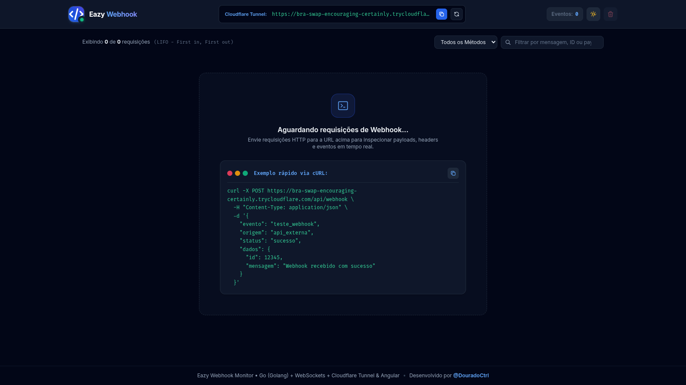
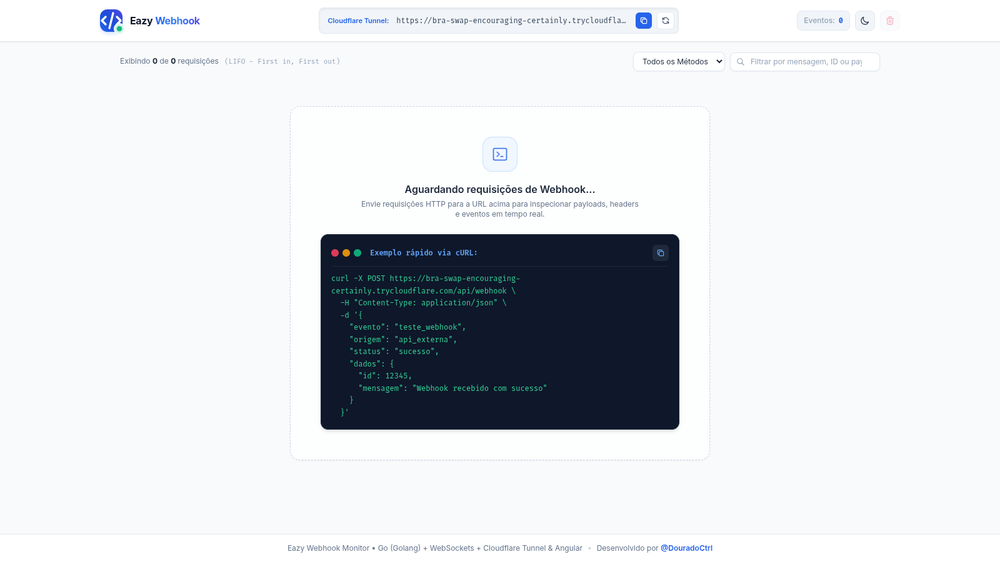

# Eazy Webhook

Monitor de Webhooks em tempo real com **Go (Backend)** e **Angular (Frontend)**.

Ao iniciar o backend, um tunel publico HTTPS do Cloudflare e gerado automaticamente para voce testar integracoes com Chipeiras, gateways de pagamento, APIs e servicos externos.

---

## Pre-requisitos e Versoes

| Tecnologia | Versao Minima | Versao Utilizada no Projeto |
| :--- | :---: | :---: |
| **Go (Golang)** | `>= 1.22` | `1.22+` / `1.26` |
| **Node.js** | `>= 20.x` | `v22.22.2` |
| **Angular** | `19.x` | `19.2.1` |
| **Tailwind CSS** | `3.x` | `3.4.17` |

---

## Demonstracao Visual

### Modo Escuro (Dark Theme)


### Modo Claro (Light Theme)


---

## Como Executar

### 1. Iniciar o Backend (Go)

```bash
cd golang
go run .
```

> O backend rodara em `http://localhost:3000` e exibira no terminal a URL publica gerada (ex: `https://*.trycloudflare.com/api/webhook`).

---

### 2. Iniciar o Frontend (Angular)

Abra outro terminal e execute:

```bash
cd angular
npm install
npm start
```

Acesse no navegador: **`http://localhost:4200`**

---

## Como Testar

Com o backend e frontend rodando, envie uma requisicao de teste via terminal:

```bash
curl -X POST http://localhost:3000/api/webhook \
  -H "Content-Type: application/json" \
  -d '{"evento": "teste", "mensagem": "Webhook funcionando!"}'
```

O webhook aparecera instantaneamente na tela em tempo real.

---

## Estrutura das Pastas

- `golang/`: Servidor de alta performance em Go com WebSockets nativos e Tunel Cloudflare.
- `angular/`: Interface visual moderna em Angular 19 com Tailwind CSS (Modo Claro/Escuro).
- `docs/images/`: Imagens de demonstracao do dashboard para documentacao.
